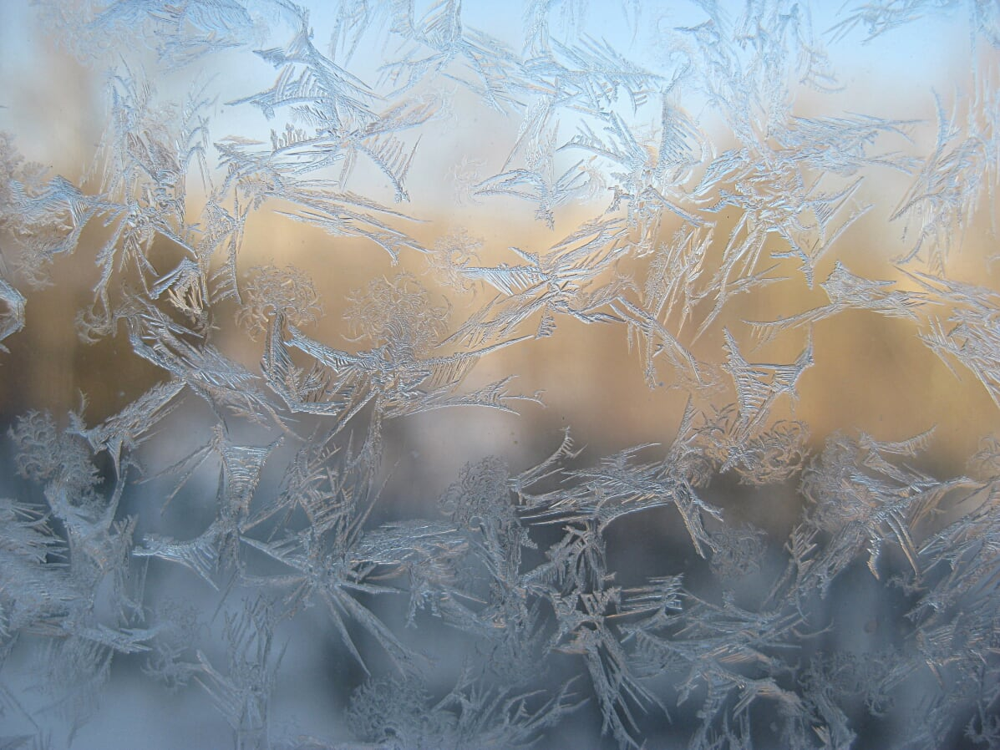

### Hi there 👋

My name is Mikhail Koverda and I am a graduate student at Yaroslavl state University, Russia ❄️🥶. Here I share small useful pieces of code that I use in my scientific work.

### How to find me 🌿

Write on e-mail **m@kovd.su**

### Papers

At the moment, the code posted here is used in the following articles.

- Koverda M., Ofitserov E., Shilanova E., Orlov V. Using the molecular rotational motion concept to predict the volume expansion coefficients of liquids. *Physics and Chemistry of Liquids*, 2020 (in print). DOI: https://doi.org/10.1080/00319104.2020.1814774.

